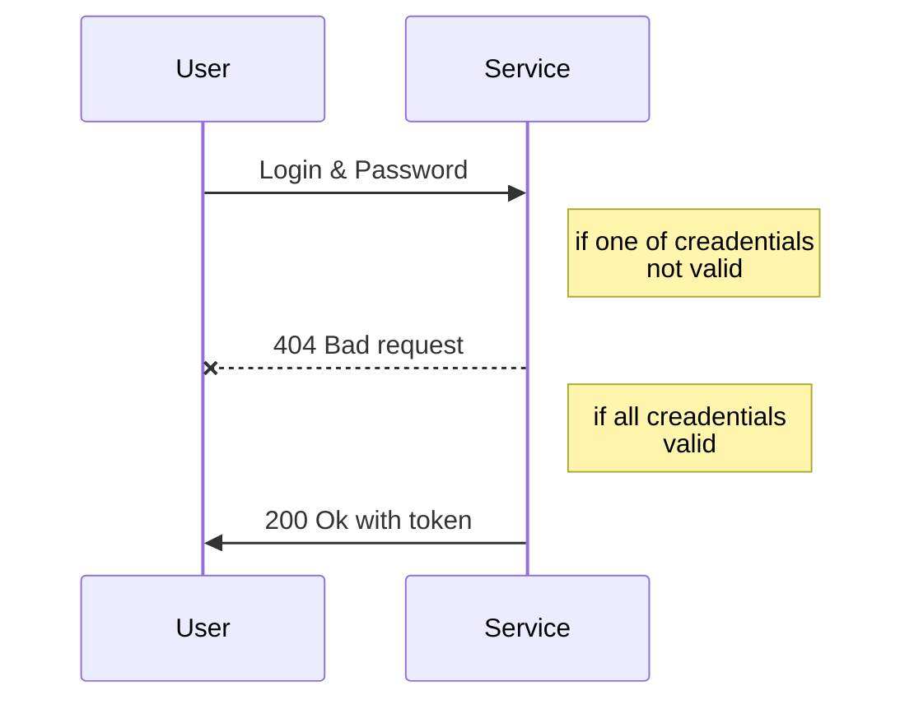

# Node JS REST API starter pack

This is a starter pack REST API NodeJS based for fast develop advanced API services with Enterprise architecture. 

## Installation

    npm install

## Usage

Development mode

    npm run start
Production

    npm run start:prod
Run test

    npm run test

## Features:
 - Typescript 3+
 - NestJS 5 (Express powered)
 - JWT
 - Mongoose - typegoose
 - Automapper
 - Swagger
 - Jest
 - RxJS

All modules has last versions and regular updated

# Architecture

Inspired by Angular. Great thanks to [NESTJS](https://nestjs.com/)
Go to docs for more information about framework and best practices

 - **config** - contains `default.ts` with env parameters
 - **src**
	 - **shared** - complete features for any purposes
	 - **todo** - example implementation secure routes
	 - **user** - auth routes

## Create modules/services and folders

Nest provides an out-of-the-box application architecture which allows for effortless creation of highly testable, scalable, loosely coupled, and easily maintainable applications.
Use Nest [CLI](https://docs.nestjs.com/cli/usages) for correct creating new modules/services & controllers

## JWT Authorization

## Secure routes
Get more about [Guards](https://docs.nestjs.com/guards)
Two protection schemes have been implemented:

 1. JWT Guard - protect access by validation token
 2. Role Guard - protect access by user role

## Stay in touch

[Alex Kotovsky](https://github.com/Kotovskyart)

*2.11.2018*

